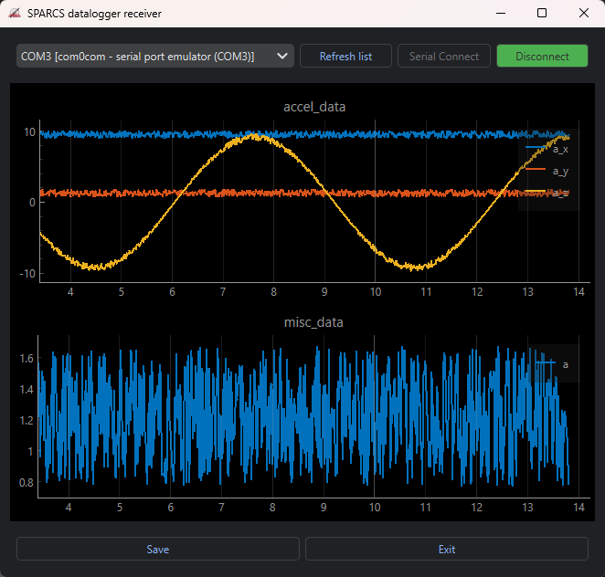

# CLAB-datalogger-receiver
This repo is a reimplementation of the MATLAB datalogger project in python.

This is to prevent some errors occurring during the ERTC course due MATLAB's
serial interface that was not working properly,
and also to increase code portability.



## Docs

To have a better insight of te project, you can head over to the more extensive
[docs](/docs/index.md).


## How-to

This is a runnable package, meaning that it is possible to run

```console
python -m clab_datalogger_receiver
```

or by launching the `run_receiver.bat` file.

Notice that the package needs first to be installed.

This can be done by running `install_package.bat`

On launch, it will connect to the serial port,
( asking whuch one, if multiple are available),
and send the `START_TRANSMISSION` token to the datalogger.

It is possible to stop the data recording both by pressing `CTRL+C` or by closing the plot window.

The script will then ask if it should save the data (default is yes).

## Packets configuration

It is possible to configure the serial data format in (mainly) two ways:

- By editing the file `struct_cfg.yaml`, that is loaded by the function call `PlottingStruct.from_yaml_file()`
- By calling the function `PlottingStruct.from_string_list(formats list)`, where formats is a list of format string that follows the convention of python's `struct`, as in [here](https://docs.python.org/3/library/struct.html#format-characters)
